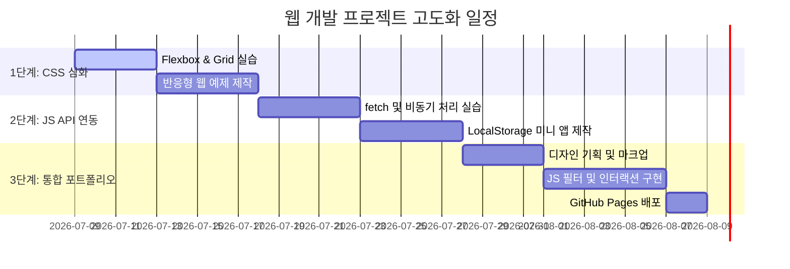

# 📚 웹 개발 학습 프로젝트 통합 계획서 (Integrated Plan)

본 문서는 `C:\Users\PC\Desktop\project10\html` 경로의 HTML/CSS/JS 학습 프로젝트의 현재 상태를 분석하고, 이를 기반으로 한 단계 높은 수준의 웹 애플리케이션 개발로 나아가기 위한 통합 계획을 제시합니다.

---

## 1. 프로젝트 개요 및 분석
본 프로젝트는 웹 프론트엔드 개발의 3대 핵심 요소인 HTML, CSS, JavaScript를 단계별로 학습하고 실습하는 프로젝트입니다.

### 📂 현재 폴더 구조 및 현황 분석

| 폴더/파일명 | 용도 및 내용 | 현재 진행 수준 | 분석 및 평가 |
| :--- | :--- | :--- | :--- |
| **`01` (HTML)** | HTML5 기본 문법 및 콘텐츠 실습 | 파일 28개 완료 (기본 태그, 미디어 삽입, 엔티티 코드 등) | 웹 문서 구조 설계의 기초를 완비함. 시맨틱 마크업을 적절히 활용하고 있음. |
| **`02` (CSS)** | CSS 스타일링 및 레이아웃 설계 | 파일 94개 완료 (가상 선택자, 박스 모델, Figma 시안 구현, 레이아웃 실습 등) | 선택자 활용도가 높고 Figma 스타일 구현까지 진행되어 디자인 재현 능력이 우수함. |
| **`03`** | (비어 있음) | 0개 파일 | 반응형 웹, CSS 애니메이션, Flexbox/Grid 심화 학습을 위해 예약되었으나 비어 있는 상태임. |
| **`04` (JavaScript)** | JS 기초 및 DOM 조작, 이벤트 처리 | 파일 30개 완료 (BMI 계산기, 함수 예제, 이벤트 처리 등) | 기본적인 변수, 함수, DOM 인터랙션을 다룰 수 있으나, 비동기 통신(API) 및 모듈화 학습이 추가로 필요함. |
| **`docs` / `doc`** | 명명 규칙, 가이드, 평가지 등 | 가이드 문서 완료 | `web-naming-rules.html` 등 코드 표준과 품질을 유지하기 위한 문서가 잘 준비되어 있음. |
| **`media` / `mp4`** | 미디어 리소스 저장소 | 리소스 보유 중 | 웹 페이지에 삽입되는 이미지, 비디오 리소스가 체계적으로 분류되어 있음. |
| **`index.html`** | 프로젝트 요약 대시보드 | 메인 인덱스 완료 | 학습 성과를 카드 형태로 일목요연하게 파악할 수 있도록 반응형 UI로 구성되어 있음. |

---

## 2. 주요 개선점 (Gap Analysis)
1. **`03` 폴더의 공백**: 모던 CSS(Flexbox, Grid) 및 반응형 웹 디자인(CSS Media Queries) 실습의 구체적 사례가 누락되어 있습니다.
2. **비동기 처리(API) 및 ES6+ 심화 실습 부족**: 현재 `04` 폴더의 JavaScript 실습은 DOM 조작 위주로 구성되어 있어, 실무 중심의 데이터 통신(fetch, async/await) 및 상태 관리 실습이 필요합니다.
3. **단편적 예제 중심의 학습**: 개별 예제 파일이 산재해 있어, 실무 수준의 종합적인 토이 프로젝트(예: 대시보드, 쇼핑몰, 포트폴리오 등)로의 확장이 필요합니다.

---

## 3. 단계별 통합 로드맵 (Roadmap)

### 🚀 1단계: 모던 레이아웃 및 반응형 웹 완벽 마스터 (`03` 폴더 활성화)
- **목표**: 어떤 디바이스에서도 완벽하게 동작하는 반응형 UI 구축 능력 확보.
- **세부 활동**:
  - CSS Flexbox와 Grid를 이용한 복잡한 다단 레이아웃 예제 작성.
  - 미디어 쿼리를 사용한 모바일-태블릿-데스크톱 반응형 템플릿 개발.
  - CSS custom properties (Variables)를 활용한 다크모드/라이트모드 스위칭 실습.

### ⚡ 2단계: JavaScript 동적 기능 고도화 및 Web API 연동 (`04` 폴더 확장)
- **목표**: 정적인 페이지를 동적으로 제어하고 외부 데이터를 가져와 렌더링하는 dynamic application 구현.
- **세부 활동**:
  - Open Weather API 또는 Movie API 등을 활용한 실시간 데이터 대시보드 개발.
  - LocalStorage를 활용한 데이터 유지관리 기능(예: Todo List, 북마크 관리자).
  - Vanilla JS를 이용한 컴포넌트 기반 구조화 설계 실습.

### 🎨 3단계: 통합 포트폴리오 허브 사이트 제작 (종합 프로젝트)
- **목표**: 기존 `index.html`을 프리미엄 디자인 가이드라인에 맞춘 인터랙티브 포트폴리오 허브로 전면 개편.
- **세부 디자인 전략**:
  - **비주얼 엑설런트**: 세련된 퍼플-블루 톤의 그라데이션, Glassmorphic 카드 디자인 적용.
  - **마이크로 애니메이션**: 호버 효과, 부드러운 스크롤링, 카드 카드 플립 애니메이션 삽입.
  - **검색 및 필터링**: JS를 이용하여 HTML/CSS/JS 태그별 예제를 실시간 필터링하고 검색할 수 있는 기능 추가.

---

## 4. 세부 액션 플랜 (Action Plan)

> [!IMPORTANT]
> 각 실습 단계가 끝날 때마다 공통 스타일 시트(`reset.css`, `style.css`)를 유지하며 코드의 일관성과 표준 명명 규칙(`web-naming-rules.html`)을 철저히 준수해야 합니다.
